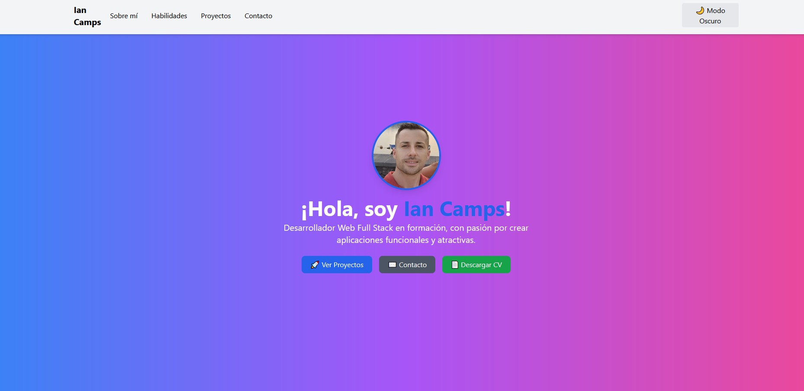

# 🌐 Portafolio de Ian Camps

Este es mi portafolio personal, creado con **React**, **Vite** y **Tailwind CSS**.

## 🚀 Tecnologías usadas:
- **React**
- **Tailwind CSS**
- **Vite**
- **Framer Motion** (para animaciones)
- **EmailJS** (para el formulario de contacto)

## 📥 Instalación y ejecución:
```bash
git clone https://github.com/iancamps90/portfolio.git
cd portfolio
npm install
npm run dev

🌍 Despliegue en GitHub Pages:

npm run build
npm run deploy

📷 Capturas de pantalla:




📫 Contacto:

    Email: iancamps90@gmail.com
    GitHub: github.com/iancamps90
    LinkedIn: linkedin.com/in/ian-camps